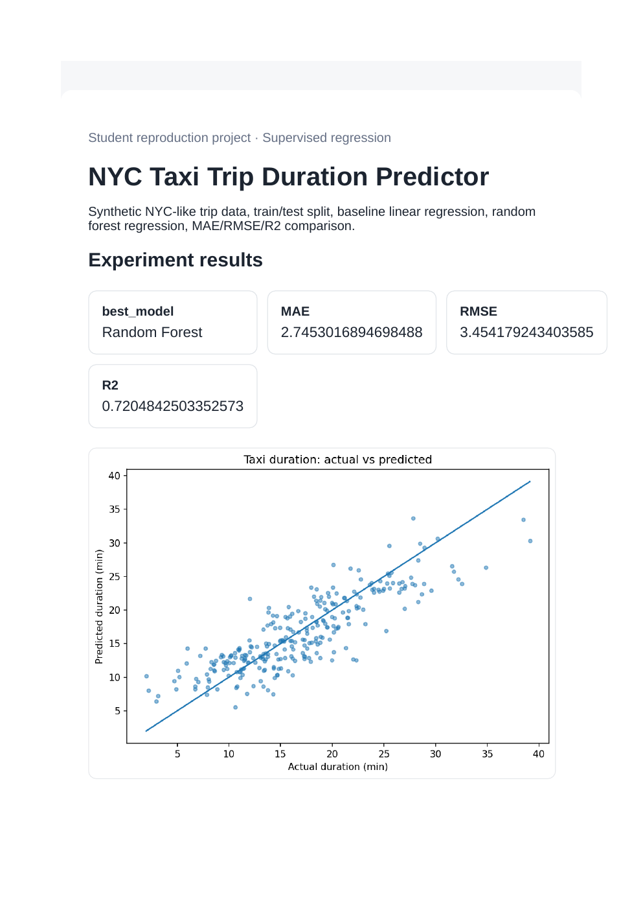
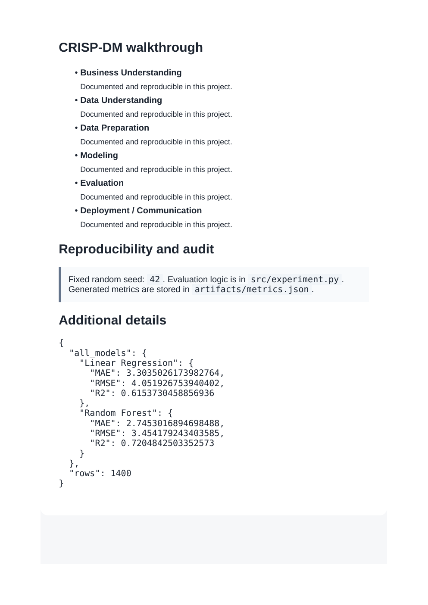

# NYC Taxi Trip Duration Predictor

**Domain:** Supervised regression

## What this does

Synthetic NYC-like trip data, a train/test split, a linear regression baseline, and a random forest, compared on MAE/RMSE/R2.

Compares a linear baseline against a random forest to show the value of a non-linear model for trip-duration regression.

## Dataset

Reference dataset/theme: **NYC Taxi Trip Duration (Kaggle)**. This project uses a small, deterministic, offline dataset (built-in scikit-learn data or a seeded synthetic equivalent) so it runs the same way on any laptop without external credentials or network access. See `prompts.md` for how this maps to the original prompt.

## How to run

```bash
pip install -r requirements.txt      # once, from the repository root
python 01_nyc_taxi_trip_prediction/src/experiment.py
```

Then open `01_nyc_taxi_trip_prediction/dashboard.html` in a browser.

## Results (this run)

| Metric | Value |
|---|---|
| best_model | Random Forest |
| MAE | 2.7455 |
| RMSE | 3.4541 |
| R2 | 0.7205 |

Full numbers are also saved to `artifacts/metrics.json` and `artifacts/result.png` every time the script runs, so this table never goes stale.

## Screenshots




## Prompt

See [`prompts.md`](prompts.md) for the exact prompt used to build this project.
