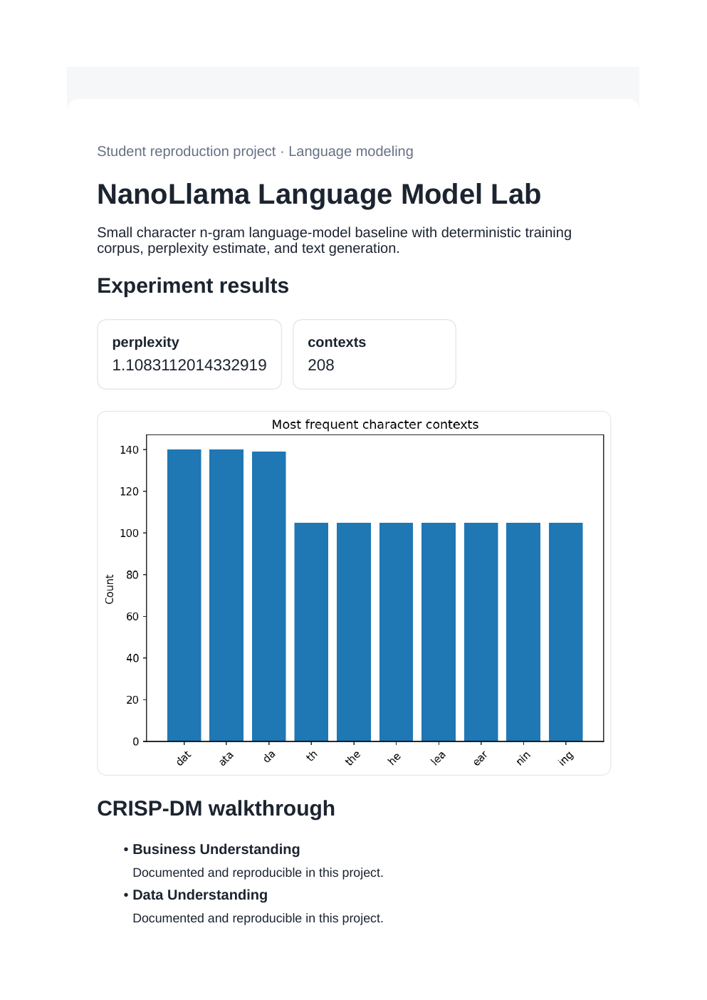
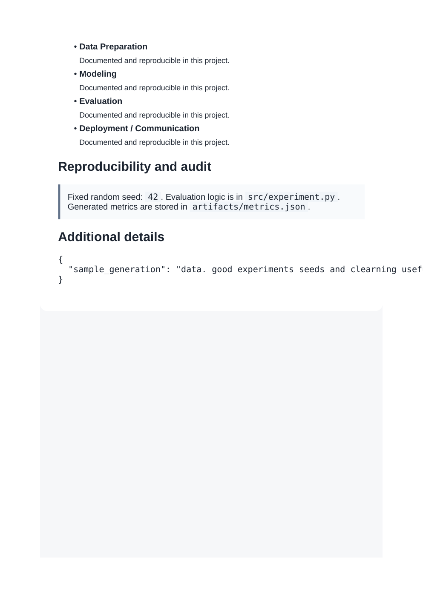

# NanoLlama Language Model Lab

**Domain:** Language modeling

## What this does

A small character-level language model trained on a deterministic text corpus, evaluated with perplexity and used to generate text.

Trains a tiny character-level language model end to end and reports perplexity, the same evaluation idea used for much larger models.

## Dataset

Reference dataset/theme: **Tiny educational text corpus (offline reproduction)**. This project uses a small, deterministic, offline dataset (built-in scikit-learn data or a seeded synthetic equivalent) so it runs the same way on any laptop without external credentials or network access. See `prompts.md` for how this maps to the original prompt.

## How to run

```bash
pip install -r requirements.txt      # once, from the repository root
python 02_nano_llm_transformer/src/experiment.py
```

Then open `02_nano_llm_transformer/dashboard.html` in a browser.

## Results (this run)

| Metric | Value |
|---|---|
| perplexity | 1.1083 |
| contexts | 208 |

Full numbers are also saved to `artifacts/metrics.json` and `artifacts/result.png` every time the script runs, so this table never goes stale.

## Screenshots




## Prompt

See [`prompts.md`](prompts.md) for the exact prompt used to build this project.
