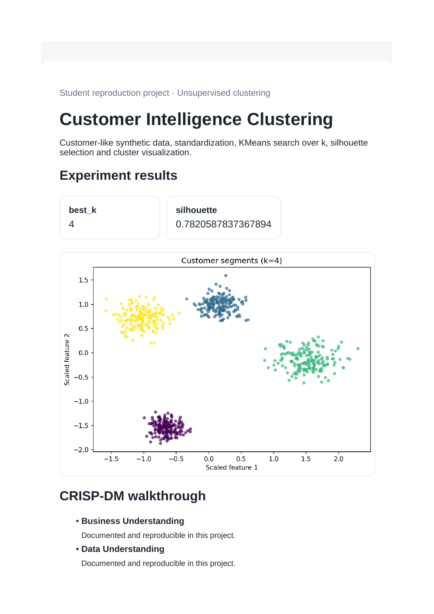
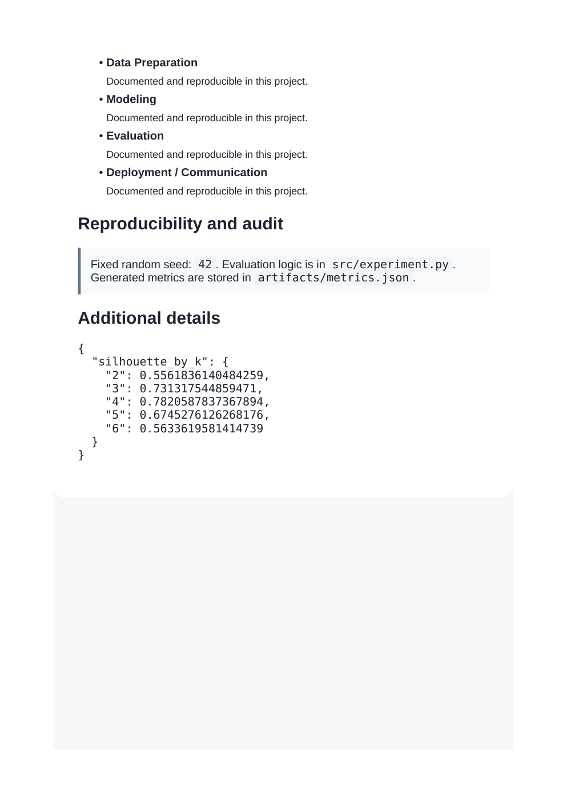

# Customer Intelligence Clustering

**Domain:** Unsupervised clustering

## What this does

Standardized customer-like data, a KMeans search over several values of k, and cluster selection by silhouette score.

Picks the number of customer segments automatically by scanning k and keeping the best silhouette score, instead of guessing k.

## Dataset

Reference dataset/theme: **Mall Customer Segmentation style data**. This project uses a small, deterministic, offline dataset (built-in scikit-learn data or a seeded synthetic equivalent) so it runs the same way on any laptop without external credentials or network access. See `prompts.md` for how this maps to the original prompt.

## How to run

```bash
pip install -r requirements.txt      # once, from the repository root
python 03_customer_segmentation_clustering/src/experiment.py
```

Then open `03_customer_segmentation_clustering/dashboard.html` in a browser.

## Results (this run)

| Metric | Value |
|---|---|
| best_k | 4 |
| silhouette | 0.7821 |

Full numbers are also saved to `artifacts/metrics.json` and `artifacts/result.png` every time the script runs, so this table never goes stale.

## Screenshots




## Prompt

See [`prompts.md`](prompts.md) for the exact prompt used to build this project.
