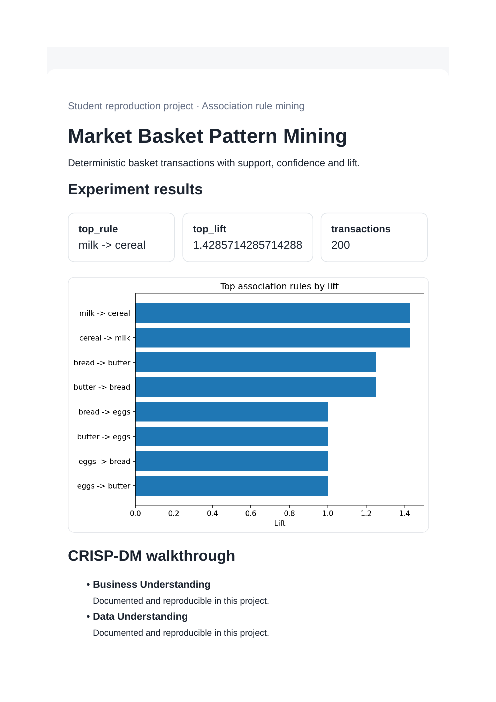
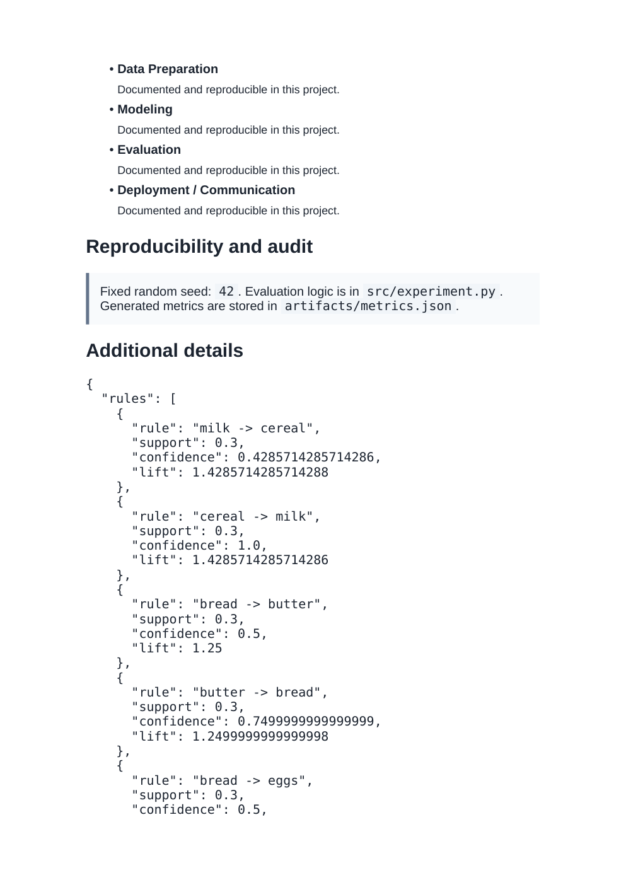

# Market Basket Pattern Mining

**Domain:** Association rule mining

## What this does

Deterministic basket transactions with item/pair support, confidence, and lift, ranked to surface the strongest association rules.

Mines market-basket rules (support, confidence, lift) the same way retailers decide what to shelve next to what.

## Dataset

Reference dataset/theme: **Online Retail style transaction data**. This project uses a small, deterministic, offline dataset (built-in scikit-learn data or a seeded synthetic equivalent) so it runs the same way on any laptop without external credentials or network access. See `prompts.md` for how this maps to the original prompt.

## How to run

```bash
pip install -r requirements.txt      # once, from the repository root
python 04_associative_pattern_mining/src/experiment.py
```

Then open `04_associative_pattern_mining/dashboard.html` in a browser.

## Results (this run)

| Metric | Value |
|---|---|
| top_rule | milk -> cereal |
| top_lift | 1.4286 |
| transactions | 200 |

Full numbers are also saved to `artifacts/metrics.json` and `artifacts/result.png` every time the script runs, so this table never goes stale.

## Screenshots




## Prompt

See [`prompts.md`](prompts.md) for the exact prompt used to build this project.
