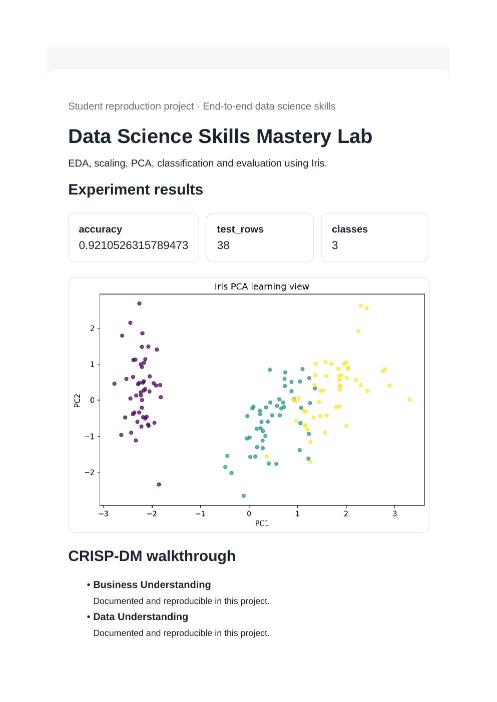
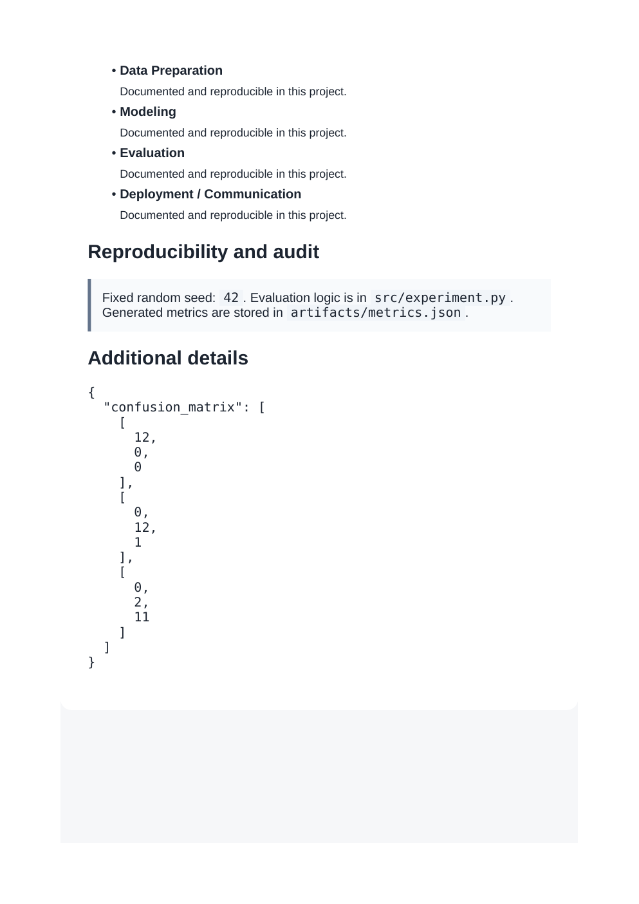

# Data Science Skills Mastery Lab

**Domain:** End-to-end data science skills

## What this does

EDA, feature scaling, PCA, a classifier, cross-validation, and feature importance on the Iris dataset.

One script that exercises the full classic ML toolkit -- EDA, scaling, PCA, cross-validation, feature importance -- on a single dataset.

## Dataset

Reference dataset/theme: **Iris (scikit-learn)**. This project uses a small, deterministic, offline dataset (built-in scikit-learn data or a seeded synthetic equivalent) so it runs the same way on any laptop without external credentials or network access. See `prompts.md` for how this maps to the original prompt.

## How to run

```bash
pip install -r requirements.txt      # once, from the repository root
python 05_data_science_skills_lab/src/experiment.py
```

Then open `05_data_science_skills_lab/dashboard.html` in a browser.

## Results (this run)

| Metric | Value |
|---|---|
| accuracy | 0.9211 |
| test_rows | 38 |
| classes | 3 |

Full numbers are also saved to `artifacts/metrics.json` and `artifacts/result.png` every time the script runs, so this table never goes stale.

## Screenshots




## Prompt

See [`prompts.md`](prompts.md) for the exact prompt used to build this project.
