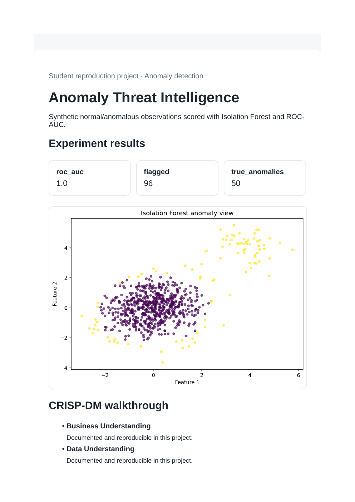
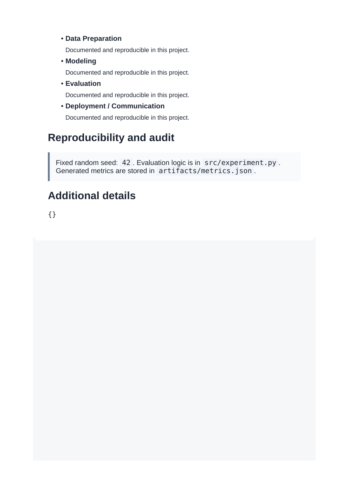

# Anomaly Threat Intelligence

**Domain:** Anomaly detection

## What this does

Synthetic normal and anomalous points scored with Isolation Forest and evaluated with ROC-AUC.

Scores points with Isolation Forest and evaluates with ROC-AUC, the standard fraud/intrusion-detection pattern.

## Dataset

Reference dataset/theme: **Credit-card-fraud style synthetic data**. This project uses a small, deterministic, offline dataset (built-in scikit-learn data or a seeded synthetic equivalent) so it runs the same way on any laptop without external credentials or network access. See `prompts.md` for how this maps to the original prompt.

## How to run

```bash
pip install -r requirements.txt      # once, from the repository root
python 06_anomaly_detection/src/experiment.py
```

Then open `06_anomaly_detection/dashboard.html` in a browser.

## Results (this run)

| Metric | Value |
|---|---|
| roc_auc | 1.0000 |
| flagged | 96 |
| true_anomalies | 50 |

Full numbers are also saved to `artifacts/metrics.json` and `artifacts/result.png` every time the script runs, so this table never goes stale.

## Screenshots




## Prompt

See [`prompts.md`](prompts.md) for the exact prompt used to build this project.
