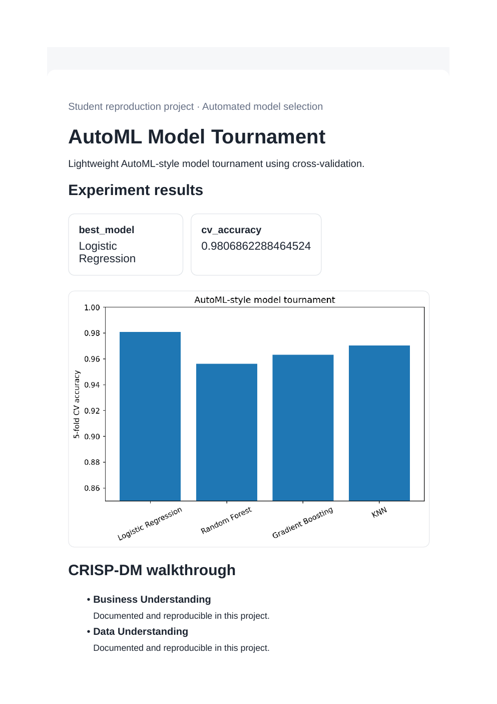
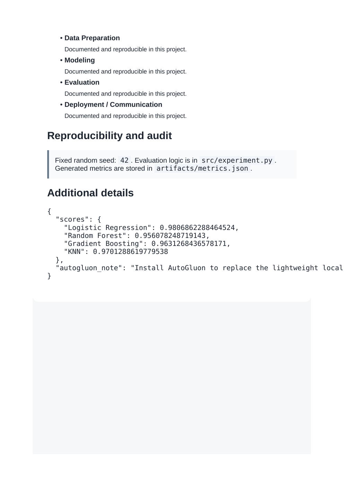

# AutoML Model Tournament

**Domain:** Automated model selection

## What this does

A lightweight AutoML-style tournament across logistic regression, random forest, gradient boosting, and KNN, scored with cross-validation.

Runs a mini AutoML tournament across four model families and reports the cross-validated winner, without needing the full AutoGluon install.

## Dataset

Reference dataset/theme: **Breast Cancer Wisconsin (scikit-learn)**. This project uses a small, deterministic, offline dataset (built-in scikit-learn data or a seeded synthetic equivalent) so it runs the same way on any laptop without external credentials or network access. See `prompts.md` for how this maps to the original prompt.

## How to run

```bash
pip install -r requirements.txt      # once, from the repository root
python 07_automl_autogluon/src/experiment.py
```

Then open `07_automl_autogluon/dashboard.html` in a browser.

## Results (this run)

| Metric | Value |
|---|---|
| best_model | Logistic Regression |
| cv_accuracy | 0.9807 |

Full numbers are also saved to `artifacts/metrics.json` and `artifacts/result.png` every time the script runs, so this table never goes stale.

## Screenshots




## Prompt

See [`prompts.md`](prompts.md) for the exact prompt used to build this project.
