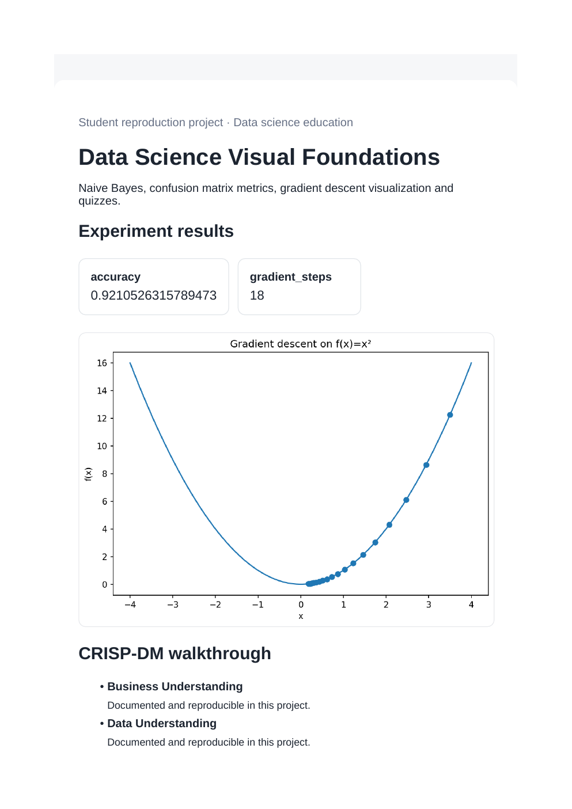
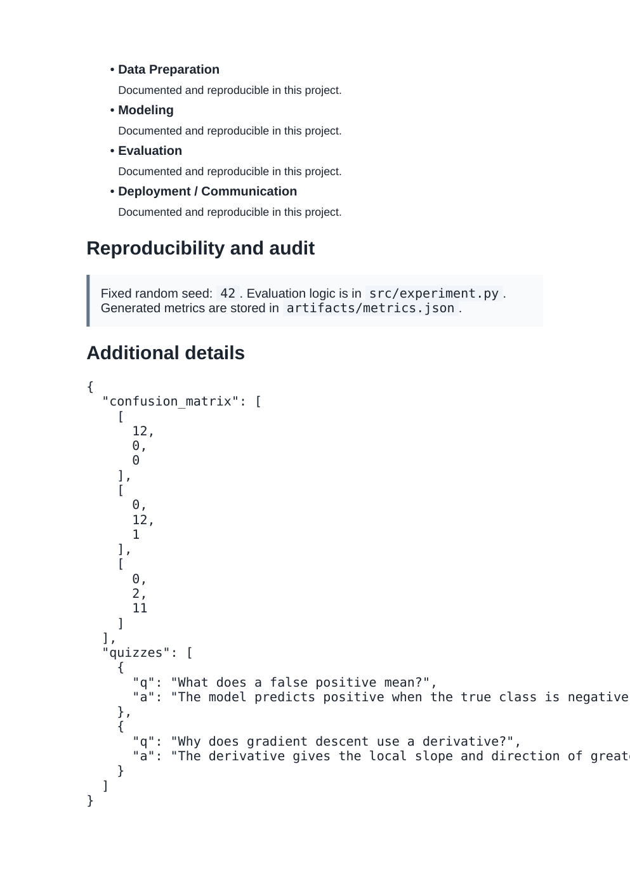

# Data Science Visual Foundations

## What this project does

Naive Bayes classifier, confusion matrix metrics, gradient descent simulation, visual learning artifacts and quiz bank.

This project reproduces the main data science idea from the supplied prompt in a way that can run on a normal laptop.

## Dataset

Iris + generated mathematical examples. See `DATASET.md` for the offline reproduction note.

## CRISP-DM summary

1. **Business understanding:** define the decision or learning goal.
2. **Data understanding:** inspect the generated or built-in dataset and target.
3. **Data preparation:** create features and keep preprocessing separate from evaluation data where applicable.
4. **Modeling:** train the selected model or algorithm.
5. **Evaluation:** report the main metric and save a plot.
6. **Deployment/communication:** generate `dashboard.html` and screenshot it.

## Run

From the repository root:

```bash
python 08_datascience_visual_mastery/src/experiment.py
```

Open `08_datascience_visual_mastery/dashboard.html` in a browser after the run.

## Main files

- `src/experiment.py` - experiment entry point
- `artifacts/metrics.json` - generated metrics
- `artifacts/result.png` - result visualization
- `dashboard.html` - student-friendly dashboard
- `AUDIT_REPORT.md` - checks for leakage and reproducibility
- `prompts.md` - reproduction prompt

## Screenshots

### Results view



### CRISP-DM and audit view



## YouTube walkthrough

Walkthrough video: **ADD_YOUTUBE_LINK_HERE**

The exact speaking notes for this project are also included in the top-level `VIDEO_SCRIPT.md`.
