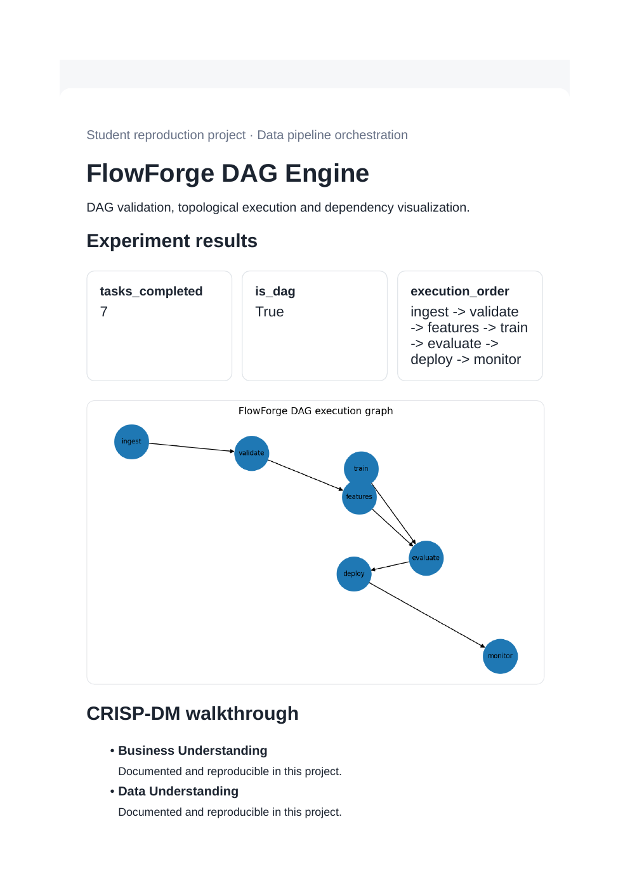
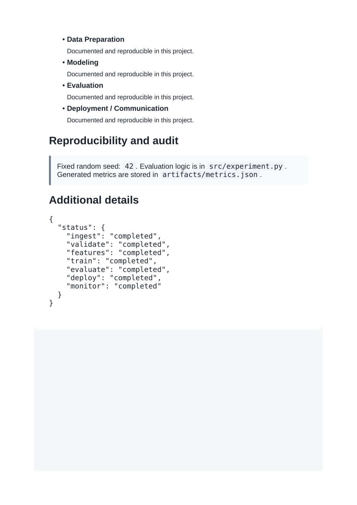

# FlowForge DAG Engine

**Domain:** Data pipeline orchestration

## What this does

A directed-acyclic-graph validation step, topological execution ordering, and a task-status simulation.

Validates a task graph is a true DAG, then computes a topological execution order -- the core scheduling logic behind tools like Airflow.

## Dataset

Reference dataset/theme: **Synthetic pipeline graph**. This project uses a small, deterministic, offline dataset (built-in scikit-learn data or a seeded synthetic equivalent) so it runs the same way on any laptop without external credentials or network access. See `prompts.md` for how this maps to the original prompt.

## How to run

```bash
pip install -r requirements.txt      # once, from the repository root
python 09_flowforge_dag_engine/src/experiment.py
```

Then open `09_flowforge_dag_engine/dashboard.html` in a browser.

## Results (this run)

| Metric | Value |
|---|---|
| tasks_completed | 7 |
| is_dag | True |
| execution_order | ingest -> validate -> features -> train -> evaluate -> deploy -> monitor |

Full numbers are also saved to `artifacts/metrics.json` and `artifacts/result.png` every time the script runs, so this table never goes stale.

## Screenshots




## Prompt

See [`prompts.md`](prompts.md) for the exact prompt used to build this project.
