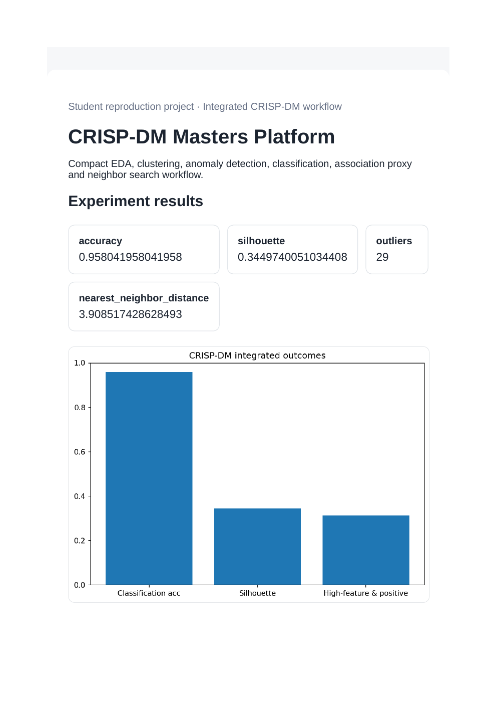
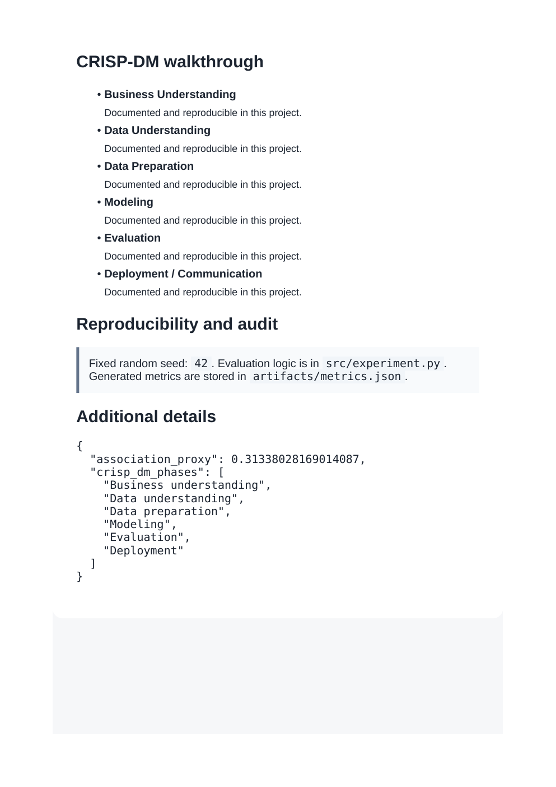

# CRISP-DM Masters Platform

**Domain:** Integrated CRISP-DM workflow

## What this does

One compact workflow covering classification, clustering, anomaly detection, an association proxy, and nearest-neighbor search on one dataset.

Exercises the full CRISP-DM loop -- classification, clustering, anomaly detection, nearest neighbor -- inside a single script.

## Dataset

Reference dataset/theme: **Breast Cancer Wisconsin (scikit-learn)**. This project uses a small, deterministic, offline dataset (built-in scikit-learn data or a seeded synthetic equivalent) so it runs the same way on any laptop without external credentials or network access. See `prompts.md` for how this maps to the original prompt.

## How to run

```bash
pip install -r requirements.txt      # once, from the repository root
python 10_crispdm_masters_curriculum/src/experiment.py
```

Then open `10_crispdm_masters_curriculum/dashboard.html` in a browser.

## Results (this run)

| Metric | Value |
|---|---|
| accuracy | 0.9580 |
| silhouette | 0.3450 |
| outliers | 29 |
| nearest_neighbor_distance | 3.9085 |

Full numbers are also saved to `artifacts/metrics.json` and `artifacts/result.png` every time the script runs, so this table never goes stale.

## Screenshots




## Prompt

See [`prompts.md`](prompts.md) for the exact prompt used to build this project.
