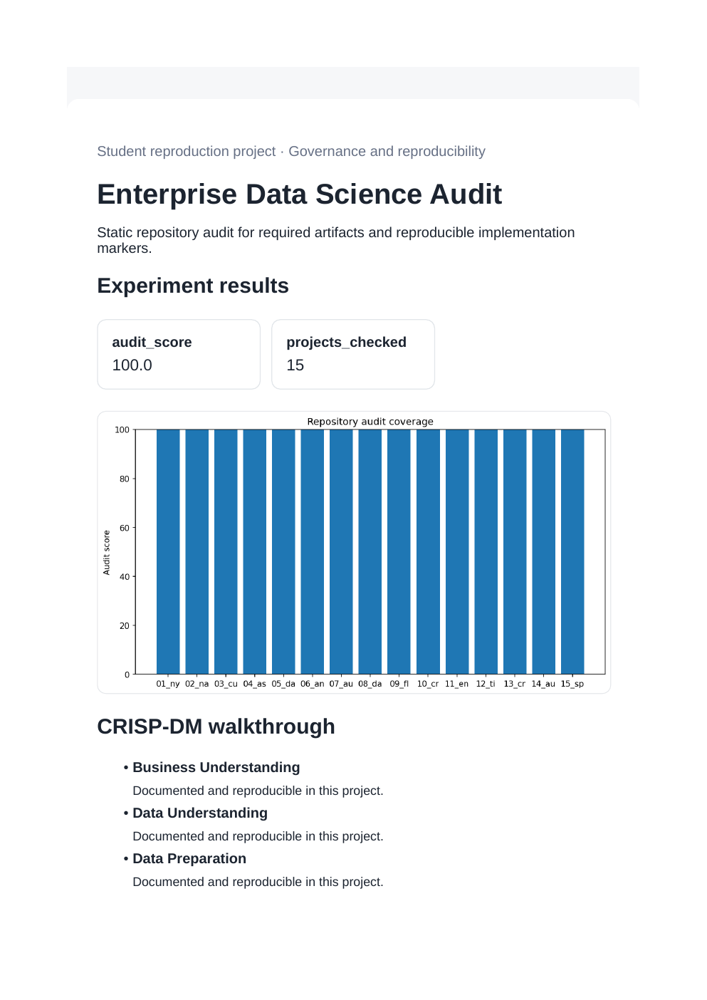
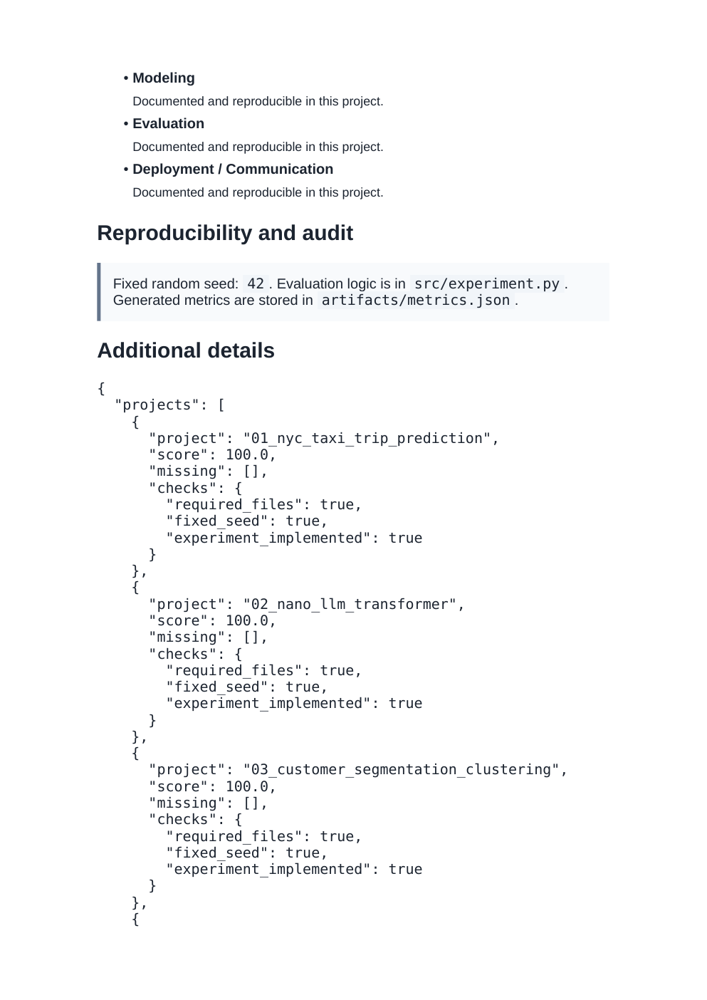

# Enterprise Data Science Audit

**Domain:** Governance and reproducibility

## What this does

A static audit of every sibling project in this repository for required files, a fixed seed, and an implemented experiment function.

Turns the repository itself into the dataset: a static audit script that checks every sibling project for required files and reproducibility markers.

## Dataset

Reference dataset/theme: **This repository**. This project uses a small, deterministic, offline dataset (built-in scikit-learn data or a seeded synthetic equivalent) so it runs the same way on any laptop without external credentials or network access. See `prompts.md` for how this maps to the original prompt.

## How to run

```bash
pip install -r requirements.txt      # once, from the repository root
python 11_enterprise_ds_audit/src/experiment.py
```

Then open `11_enterprise_ds_audit/dashboard.html` in a browser.

## Results (this run)

| Metric | Value |
|---|---|
| audit_score | 100.0000 |
| projects_checked | 15 |

Full numbers are also saved to `artifacts/metrics.json` and `artifacts/result.png` every time the script runs, so this table never goes stale.

## Screenshots




## Prompt

See [`prompts.md`](prompts.md) for the exact prompt used to build this project.
