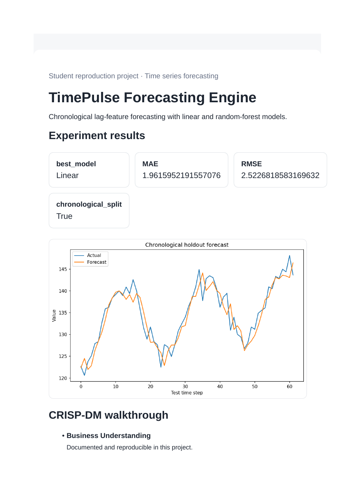
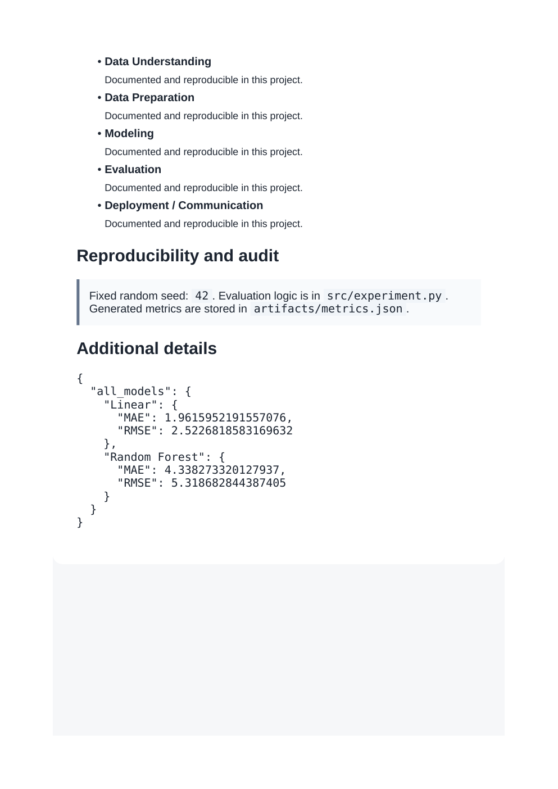

# TimePulse Forecasting Engine

## What this project does

Chronological split, lag features, linear and random-forest forecasts, MAE/RMSE comparison, no random shuffling.

This project reproduces the main data science idea from the supplied prompt in a way that can run on a normal laptop.

## Dataset

Airline-passenger style synthetic seasonal series. See `DATASET.md` for the offline reproduction note.

## CRISP-DM summary

1. **Business understanding:** define the decision or learning goal.
2. **Data understanding:** inspect the generated or built-in dataset and target.
3. **Data preparation:** create features and keep preprocessing separate from evaluation data where applicable.
4. **Modeling:** train the selected model or algorithm.
5. **Evaluation:** report the main metric and save a plot.
6. **Deployment/communication:** generate `dashboard.html` and screenshot it.

## Run

From the repository root:

```bash
python 12_timeseries_forecasting/src/experiment.py
```

Open `12_timeseries_forecasting/dashboard.html` in a browser after the run.

## Main files

- `src/experiment.py` - experiment entry point
- `artifacts/metrics.json` - generated metrics
- `artifacts/result.png` - result visualization
- `dashboard.html` - student-friendly dashboard
- `AUDIT_REPORT.md` - checks for leakage and reproducibility
- `prompts.md` - reproduction prompt

## Screenshots

### Results view



### CRISP-DM and audit view



## YouTube walkthrough

Walkthrough video: **ADD_YOUTUBE_LINK_HERE**

The exact speaking notes for this project are also included in the top-level `VIDEO_SCRIPT.md`.
