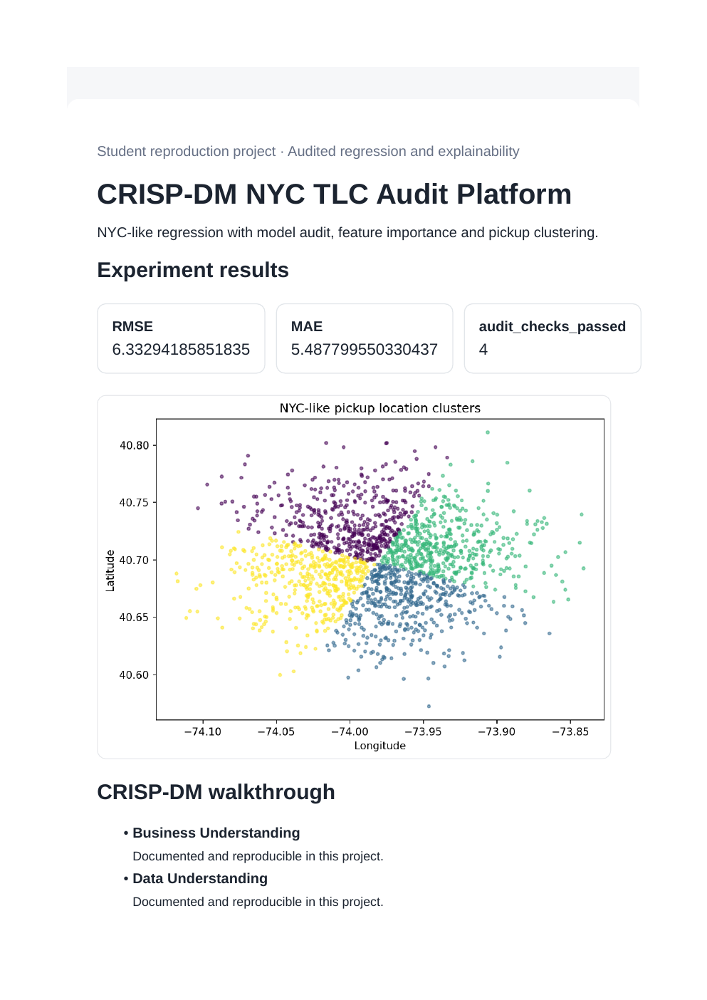
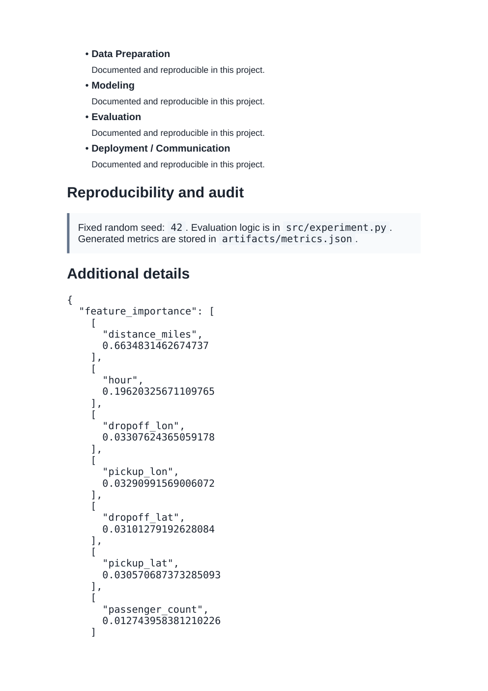

# CRISP-DM NYC TLC Audit Platform

**Domain:** Audited regression and explainability

## What this does

An NYC-taxi-style regression model with feature importance, pickup-location clustering, and explicit audit checks.

Adds model auditing and feature-importance explainability on top of an NYC-taxi-style regression task.

## Dataset

Reference dataset/theme: **NYC TLC style synthetic trip data**. This project uses a small, deterministic, offline dataset (built-in scikit-learn data or a seeded synthetic equivalent) so it runs the same way on any laptop without external credentials or network access. See `prompts.md` for how this maps to the original prompt.

## How to run

```bash
pip install -r requirements.txt      # once, from the repository root
python 13_crispdm_nyc_taxi_audit_platform/src/experiment.py
```

Then open `13_crispdm_nyc_taxi_audit_platform/dashboard.html` in a browser.

## Results (this run)

| Metric | Value |
|---|---|
| RMSE | 6.3175 |
| MAE | 5.4856 |
| audit_checks_passed | 4 |

Full numbers are also saved to `artifacts/metrics.json` and `artifacts/result.png` every time the script runs, so this table never goes stale.

## Screenshots




## Prompt

See [`prompts.md`](prompts.md) for the exact prompt used to build this project.
