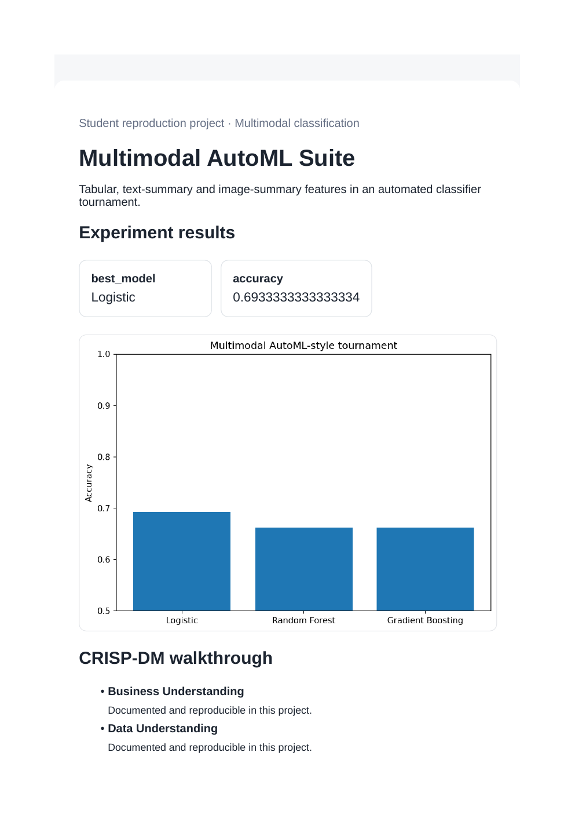
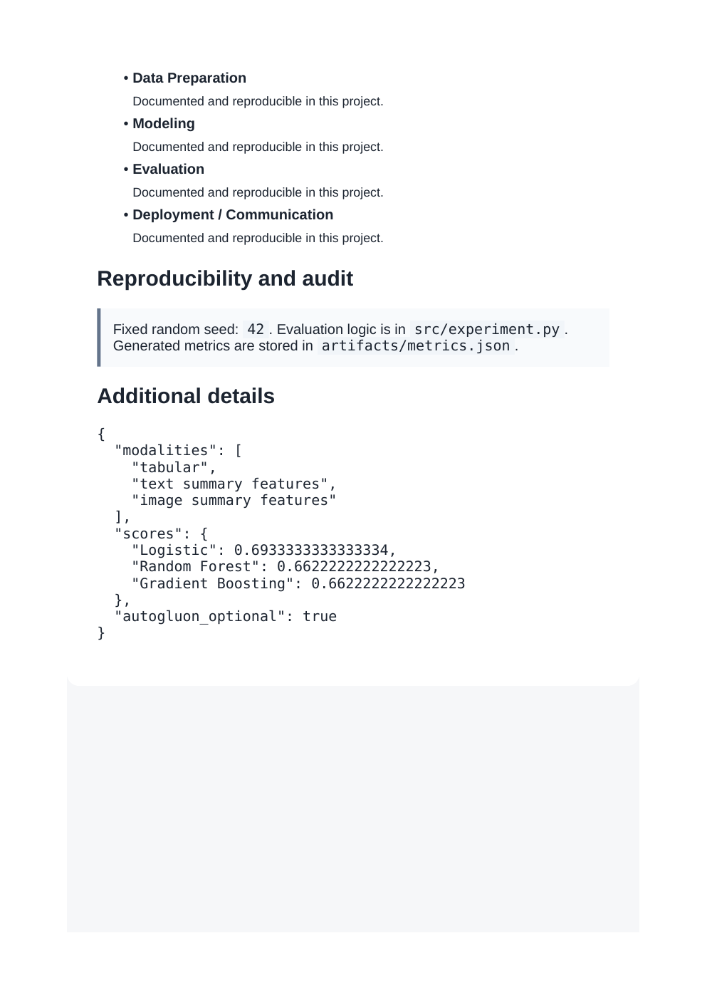

# Multimodal AutoML Suite

**Domain:** Multimodal classification

## What this does

Tabular, text-count, and image-summary features combined into one vector, then scored with an automated classifier tournament.

Combines tabular, text, and image-derived features into one feature vector before running the model tournament.

## Dataset

Reference dataset/theme: **Synthetic tabular + text + image-signal benchmark**. This project uses a small, deterministic, offline dataset (built-in scikit-learn data or a seeded synthetic equivalent) so it runs the same way on any laptop without external credentials or network access. See `prompts.md` for how this maps to the original prompt.

## How to run

```bash
pip install -r requirements.txt      # once, from the repository root
python 14_autogluon_multimodal_automl_suite/src/experiment.py
```

Then open `14_autogluon_multimodal_automl_suite/dashboard.html` in a browser.

## Results (this run)

| Metric | Value |
|---|---|
| best_model | Logistic |
| accuracy | 0.6933 |

Full numbers are also saved to `artifacts/metrics.json` and `artifacts/result.png` every time the script runs, so this table never goes stale.

## Screenshots




## Prompt

See [`prompts.md`](prompts.md) for the exact prompt used to build this project.
