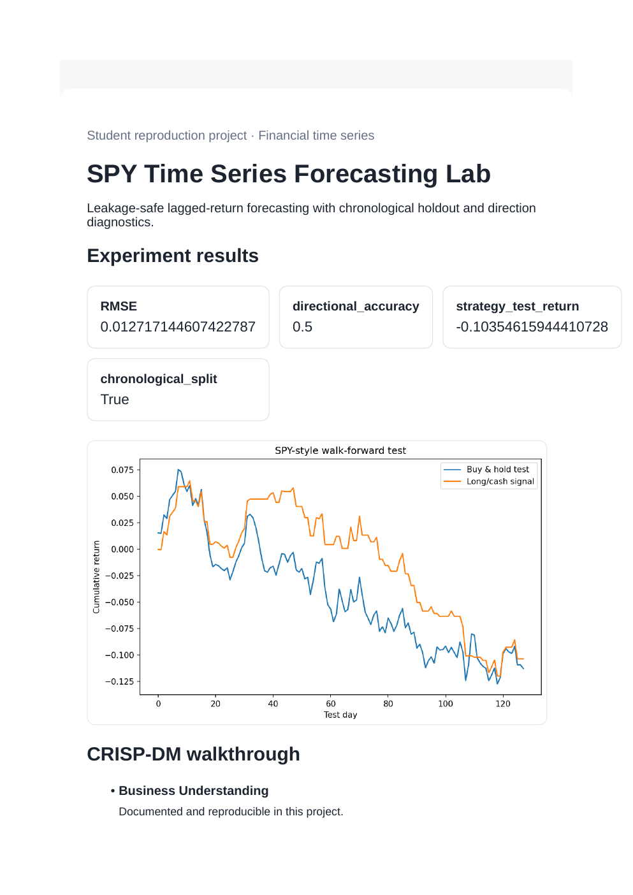
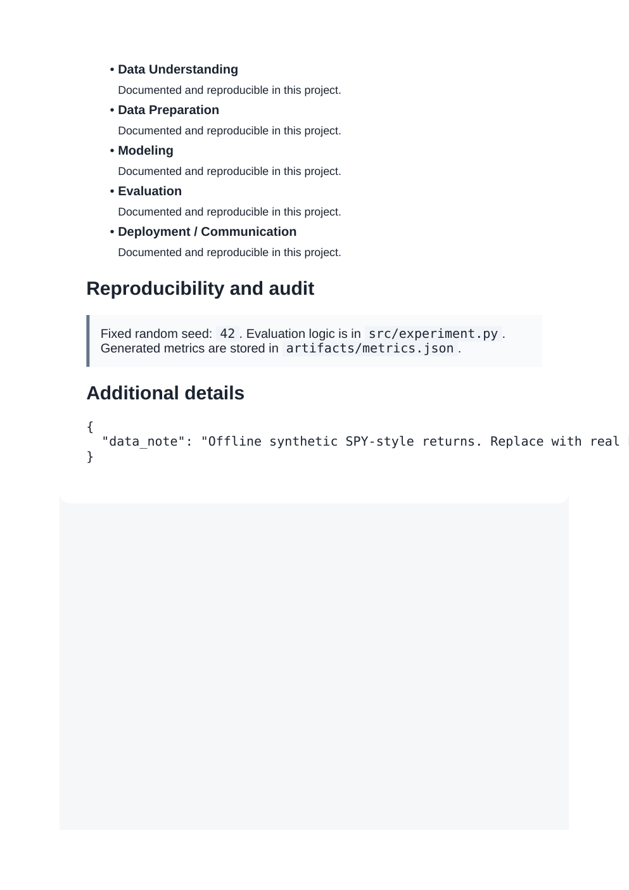

# SPY Time Series Forecasting Lab

**Domain:** Financial time series

## What this does

Leakage-safe lagged-return forecasting with a walk-forward holdout, directional accuracy, RMSE, and a simple long/cash strategy readout.

Forecasts next-day returns with a walk-forward holdout and reports directional accuracy plus a simple trading-strategy readout.

## Dataset

Reference dataset/theme: **SPY-style synthetic price series; accepts a real SPY CSV**. This project uses a small, deterministic, offline dataset (built-in scikit-learn data or a seeded synthetic equivalent) so it runs the same way on any laptop without external credentials or network access. See `prompts.md` for how this maps to the original prompt.

## How to run

```bash
pip install -r requirements.txt      # once, from the repository root
python 15_spy_timeseries_sota_forecasting/src/experiment.py
```

Then open `15_spy_timeseries_sota_forecasting/dashboard.html` in a browser.

## Results (this run)

| Metric | Value |
|---|---|
| RMSE | 0.0127 |
| directional_accuracy | 0.5078 |
| strategy_test_return | -0.0889 |
| chronological_split | True |

Full numbers are also saved to `artifacts/metrics.json` and `artifacts/result.png` every time the script runs, so this table never goes stale.

## Screenshots




## Prompt

See [`prompts.md`](prompts.md) for the exact prompt used to build this project.
